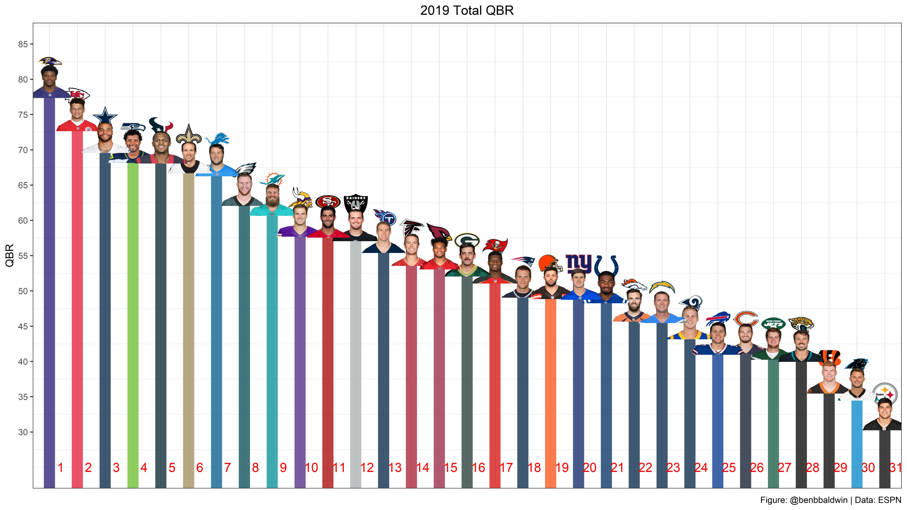

```{r setup, include=FALSE, echo=TRUE, warning=FALSE}
library(tidyverse) # Data Cleaning, manipulation, summarization, plotting
library(gt) # beautiful tables
library(DT) # beautiful interactive tables
library(ggthemes) # custom pre-built themes
library(bbplot) # more themes
library(ggtext) # custom text color
library(teamcolors) # NFL team colors and logos
library(ggforce) # better annotations
library(ggridges) # many distributions at once
library(ggrepel) # better labels
library(ggbeeswarm)
library(waffle)
library(rvest) # webscraping in R
library(glue) # awesome text creation
library(gganimate) # create gifs with ggplot
library(ggimage) # load team images in ggplot

pbp <- read_csv("https://raw.githubusercontent.com/guga31bb/nflfastR-data/master/data/play_by_play_2019.csv.gz")
```

## How to improve your `nflfastR` graphics

This resource is modeled after the fantastic [BBC Graphics Cookbook](https://bbc.github.io/rcookbook/), which is also worth checking out. The `nflscrapR` team ([Maksim Horowitz](https://twitter.com/bklynmaks/), [Ron Yurko](https://twitter.com/Stat_Ron/), and [Sam Ventura](https://twitter.com/stat_sam/)) have compiled easy to access play-by-play stats opening a deeper world of NFL analytics for reporters, bloggers and enthusiasts (and probably some NFL teams). This work has been extended in [`nflfastR`](https://mrcaseb.github.io/nflfastR/) by [Sebastian Carl](https://twitter.com/mrcaseb) and [Ben Baldwin](https://twitter.com/benbbaldwin). [Ben Baldwin](https://twitter.com/benbbaldwin) has compiled a [quickstart guide](https://mrcaseb.github.io/nflfastR/articles/beginners_guide.html) to using this data. As such, this resource is not aimed at reproducing that tutorial, but giving you some quick guides for improving the graphics you create via `ggplot2`. It's easy to get started quickly exploring the data with `ggplot2` and hopefully this helps with your "publication" quality plots.

I am providing a lot of my own **opinion** on certain dataviz choices - everyone is allowed to make their own decisions with regards to colors, ink use, chart type - but I do hope that this resource opens your eyes to some of the art of dataviz now that you have made progress with the science.

The source code for this webpage is on [Github](https://github.com/jthomasmock/nfl_plotting_cookbook) if you want to take a look.

## Additional Resources

If you'd rather go deeper into a textbook and ignore specific applications related to `nflscrapR`, check out these amazing free online resources (some available in print as well):  

| Title/Link | Author | Description |
| :--- | :--- |:---------------|
| [R for Data Science](https://r4ds.had.co.nz/) | Hadley Wickham, Garret Grolemund | A great overview of the `tidyverse`, covers everything from reading data in, data manipulation/summarization, data viz, and general programming in R |
| [SocViz](https://socviz.co/lookatdata.html#lookatdata) | Kieran Hiely | Covers exactly HOW to create a lot of different plot types in `R`/`ggplot2` |
| [Fundamentals of Data Viz](https://serialmentor.com/dataviz/) | Claus Wilke | Covers the WHY of Data Viz where all examples are in R, but no code examples in the book, but are available on his [GitHub](https://github.com/clauswilke/dataviz) |
| [BBPlot Cookbook](https://bbc.github.io/rcookbook/) | BBC Data Team | Intro primer to news-style graphics in `ggplot2` |
| [`ggplot2` cookbook](http://www.cookbook-r.com/Graphs/) |  Winston Chang | Quick cookbook of `ggplot2` plots |
| [R Graph Gallery](https://www.r-graph-gallery.com/) | Yan Holtz | Cookbook examples of a majority of plot types. |
| [`ggplot2` Book ](https://ggplot2-book.org/) | Hadley Wickham, Danielle Navarro | This 3rd edition of the `ggplot2` book is currently under development, but also available freely online for the first time! A more technical book that should align well with either SocViz or Fundamentals of Data Viz |

## Useful code chunks

There are a couple features that we will use throughout these examples:

### `dplyr::if_else()`

This allows you to make a binary conversion.

For example `if_else(condition, true, false)`  

* `mutate(success = if_else(epa > 0, 1, 0))`  
* `mutate(color = if_else(posteam == "PIT", "yellow", "grey))`  

### `dplyr::case_when()`

This allows you to essentially use many `if_else` statements at once

* The `~` indicates an assignment, where if the left side statement is evaluated as TRUE then the outcome is `~` (assigned) to the right side.  
  * The right side can be a number, text, etc  
  * The left side can be a simple or complex statement, but must evaluate as TRUE/FALSE (logical)  
* The final `TRUE ~ NA_character_` is basically a "catch" - if none of the other cases are met, then it will default to NA  
  * In this case we use `NA_character_` from `dplyr`, but you could also have a situation where it could simply say "nope" or revert back to some other column  
  * If you want to have the right side (assignment) be a number, you'll need to use `NA_integer_`  
* Lastly, a longer `case_when()` is presented shortly below


```{r}
pbp %>%
  mutate(
    stick_throw = case_when(
      air_yards < ydstogo ~ "Short of Sticks",
      air_yards == ydstogo ~ "At Stick",
      air_yards > ydstogo ~ "Past Stick",
      TRUE ~ NA_character_
    )
  ) %>%
  select(air_yards, ydstogo, stick_throw) %>%
  filter(!is.na(air_yards))
```


### `scale_color_identity()`

This is useful in combination with the above example of assigning color in a plot, essentially it will take the "yellow" or "grey" argument automatically.

### `scale_color_manual()` 

This allows you to specify colors of interest like `scale_color_manual(values = c("red", "black"))`

### `forcats::reorder()`

This allows you to reorder levels of a `ggplot` by another variable.

eg `reorder(posteam, epa)`

### `Helpers`

There are a few helpers used frequently throughout.

* `!` indicates not or negation, so `x != 5` means x not equal to 5.  
  * `!is.na(x)` indicates x is NOT NA  
* `%in%` means in - so `x %in% c(2, 3, 4)` means x matches 2, 3 OR 4  
* `dplyr::between(x, left, right)` - shortcut for `x >= left & x <= right`  
* `hjust`/`vjust` - this is typically assigned 0 through 1, and adjusts either the horizontal or vertical alignment

### `ggplot2` specs

The [documentation for `ggplot2`](https://ggplot2.tidyverse.org/articles/ggplot2-specs.html) cover in great detail MANY options for minor but important customizations. I'm not adding it directly here but adding as a resource. It is definitely worth parsing through, and some examples below:

* lines (size, color, type, join, end)  
* points (size, color, fill, stroke)  
* text (size, face)  
* justification (hjust, vjust, nudge_x, nudge_y)  
  

### `teamcolors` package

Gives you ALL the colors for NFL teams, although `nflfastR` also provides colors and logos via `nflfastR::teams_colors_logos`.

#### Using `teamcolors`

```{r}
filter(teamcolors, league == "nfl")
# or
nflfastR::teams_colors_logos
```

Please note that teams are listed by full name so to use them with the play-by-play data you will need to "join" the `teamcolors` and play-by-play datasets together.

The list of short teams named could be accomplished like so:

```{r}
left_join(pbp, nflfastR::teams_colors_logos, by = c("posteam" = "team_abbr"))
```

You could then use `dplyr::left_join()` to join the full full_team_names, colors, and team logos to the play-by-play data. Without getting into the weeds TOO much, a `left_join` basically finds cases where there is a matching row in the common column (posteam) for both dataframes, and then adds the additional columns from nfl_colors to the play-by-play data. Joins are a very important concept when trying to combine multiple datasets, and if you want to read more about the various types and their use cases check out the [`dplyr` joins docs](https://dplyr.tidyverse.org/reference/join.html).

Quick example below:

```{r, eval = FALSE}
# read in data
pbp <- read_csv("https://raw.githubusercontent.com/guga31bb/nflfastR-data/master/data/play_by_play_2019.csv.gz")
```

```{r}
# left_join the data together
pbp_colors <- left_join(pbp, nflfastR::teams_colors_logos, by = c("posteam" = "team_abbr"))

pbp_colors %>%
  # Excludes non-plays, eg end of quarter
  filter(!is.na(posteam)) %>%
  select(posteam, team_name, team_color, team_color2, team_logo_wikipedia) %>%
  # Distinct grabs only the distinct/unique cases of column
  distinct(posteam, .keep_all = TRUE)
```

So we can see that the posteam and team_abb are equivalent, where the full team name, colors, and logo are also added. I dropped the other 250+ columns for printing here, but they would be in the complete dataframe.

### `ggsave()`

If you are going to export your graphics, it's worth it to go through `ggsave()` rather than the `RStudio` export button.

The full [docs](https://ggplot2.tidyverse.org/reference/ggsave.html) have lots of great info but I'll summarize it here. The basic arguments in pseudocode are below.

```{r, eval = FALSE}
ggsave("plot_name.png", plot_object,
       height = x, width = y, units = "in", dpi = "300")
```

A typical call of `ggsave` would look like the below.

```{r, eval = F}
ggsave("wr_epa.png", wr_epa_plot, 
       height = 6, width = 8, units = "in", dpi = "350")
```

Arguably, the most important part is the DPI call - if you save through the export button you will typically have a low DPI (72) that has jagged edges on lines (known as aliasing), as opposed to exporting with a higher DPI which will give a higher quality appearance.

You will likely spend some time perfecting the print size of your plots, but if you use your own theme with text sized appropriately you can typically set a specific DPI and work from there.

### Changing fonts

Changing fonts for graphics in R can be easy if you use a package like `extrafont` or `showtext`. You can then change font family in your theme calls or as part of your personal theme.

`extrafont` has an [example](https://cran.r-project.org/web/packages/extrafont/README.html) walking through it's use.

`showtext` has an [example](https://cran.rstudio.com/web/packages/showtext/vignettes/introduction.html) walking through it's use.

## Prep

### Load all the libraries you need

There are a few packages I will use in this guide, most of them related to data viz.

```{r eval=FALSE}
library(tidyverse) # Data Cleaning, manipulation, summarization, plotting
library(gt) # beautiful tables
library(DT) # beautiful interactive tables
library(ggthemes) # custom pre-built themes
library(bbplot) # more themes
library(ggtext) # custom text color
library(teamcolors) # NFL team colors and logos
library(ggforce) # better annotations
library(ggridges) # many distributions at once
library(ggrepel) # better labels
library(ggbeeswarm) # beeswarm plots
library(extrafont) # for extra fonts
```

### Read in the pbp data

This is taken almost verbatim from Ben's Tutorial, but the idea is that you are adjusting the dataset to be ready for analysis. If you are interested in plays beyond pass/rush then you should probably NOT do these steps.

```{r, message=FALSE, warning=FALSE, eval = FALSE}
pbp <- read_csv("https://raw.githubusercontent.com/guga31bb/nflfastR-data/master/data/play_by_play_2019.csv.gz")
```

## Our first data summary

This is also credited to Ben:

"Let's look at which teams were the most pass-heavy in the first half on early downs with win probability between 20 and 80, excluding the final 2 minutes of the half when everyone is pass-happy:"

```{r}
kc <- pbp %>%
  filter(wp > .20 & wp < .80 & down <= 2 & qtr <= 2 & half_seconds_remaining > 120) %>%
  group_by(posteam) %>%
  summarize(mean_pass = mean(pass), 
            plays = n()) %>%
  arrange(mean_pass)

kc
```

"Kansas City led the league in passing rate 2019. Fun! Let's see what that looks like:"

```{r}
ggplot(kc, aes(x = reorder(posteam,-mean_pass), y = mean_pass)) +
  geom_text(aes(label = posteam))
```

Now this is a useful plot, but as Ben said: 
"This image is kind of a mess -- we still need a title, axis labels, etc -- but gets the point across. We'll get to that other stuff later."

Let's get to that stuff now!

### Themes

`ggplot2` out of the box comes with a bunch of themes, things like `theme_bw()`, `theme_minimal()`, `theme_classic()`, and the default `theme_grey()`.

Let's see what they look like with the same plot as above.

`theme_bw()`  

- Notice that we now have grey gridlines, a black border, and a white background.  

```{r, echo = FALSE}
ggplot(kc, aes(x = reorder(posteam,-mean_pass), y = mean_pass)) +
  geom_text(aes(label = posteam)) +
  theme_bw()
```

`theme_minimal()`  
- Notice that we still have grey gridlines, a white background, but now no black border.  

```{r, echo = FALSE}
ggplot(kc, aes(x = reorder(posteam,-mean_pass), y = mean_pass)) +
  geom_text(aes(label = posteam)) +
  theme_minimal()
```

`theme_classic()`  

- Notice that we now have NO gridlines, a half black border, and the same white background.  

```{r, echo = FALSE}
ggplot(kc, aes(x = reorder(posteam,-mean_pass), y = mean_pass)) +
  geom_text(aes(label = posteam)) +
  theme_classic()
```

But as with almost everything in `R`, there are more packages that add more functionality! In this case, there are entire packages dedicated to themes in `ggplot2` and you have the ability to build your own themes!

### More themes

```{r, eval = FALSE}
library(ggthemes)
library(bbplot)
```

The [`ggthemes` package](https://github.com/jrnold/ggthemes) gives you a wide assortment of additional themes as seen [here](https://yutannihilation.github.io/allYourFigureAreBelongToUs/ggthemes/). Most importantly it also gives you ideas about customizations to your personal theme. If you parse through the source code, you can create your own theme and utilize across your visualizations.

`theme_fivethirtyeight()`  

- The difference from `theme_minimal()` is ironically, *minimal* but the main difference is heavier grey gridlines, and a subtle grey background - which aligns with the `FiveThirtyEight` style.  

```{r, echo = FALSE}
ggplot(kc, aes(x = reorder(posteam, -mean_pass), y = mean_pass)) +
  geom_text(aes(label = posteam)) +
  theme_fivethirtyeight()
```

Again, the exciting part about `ggthemes` in my mind is the concept of creating your **own** theme. In fact, the code for this theme is pretty simple!

```{r, eval = FALSE}
theme_fivethirtyeight <- function(base_size = 12, base_family = "sans") {
  colors <- deframe(ggthemes::ggthemes_data[["fivethirtyeight"]])
  (theme_foundation(base_size = base_size, base_family = base_family)
  + theme(
      line = element_line(colour = "black"),
      rect = element_rect(
        fill = colors["Light Gray"],
        linetype = 0, colour = NA
      ),
      text = element_text(colour = colors["Dark Gray"]),
      axis.title = element_blank(),
      axis.text = element_text(),
      axis.ticks = element_blank(),
      axis.line = element_blank(),
      legend.background = element_rect(),
      legend.position = "bottom",
      legend.direction = "horizontal",
      legend.box = "vertical",
      panel.grid = element_line(colour = NULL),
      panel.grid.major =
        element_line(colour = colors["Medium Gray"]),
      panel.grid.minor = element_blank(),
      plot.title = element_text(hjust = 0, size = rel(1.5), face = "bold"),
      plot.margin = unit(c(1, 1, 1, 1), "lines"),
      strip.background = element_rect()
    ))
}
```


### Edited Theme

I personally edited this so that it didn't remove axis titles, and to have a white background instead of gray, which you can see below.

```{r}
theme_538 <- function(base_size = 12, font = "Lato") {

  # Text setting
  txt <- element_text(size = base_size + 2, colour = "black", face = "plain")
  bold_txt <- element_text(
    size = base_size + 2, colour = "black",
    family = "Montserrat", face = "bold"
  )
  large_txt <- element_text(size = base_size + 4, color = "black", face = "bold")


  theme_minimal(base_size = base_size, base_family = font) +
    theme(
      # Legend Settings
      legend.key = element_blank(),
      legend.background = element_blank(),
      legend.position = "bottom",
      legend.direction = "horizontal",
      legend.box = "vertical",

      # Backgrounds
      strip.background = element_blank(),
      strip.text = large_txt,
      plot.background = element_blank(),
      plot.margin = unit(c(1, 1, 1, 1), "lines"),

      # Axis & Titles
      text = txt,
      axis.text = txt,
      axis.ticks = element_blank(),
      axis.line = element_blank(),
      axis.title = bold_txt,
      plot.title = large_txt,

      # Panel
      panel.grid = element_line(colour = NULL),
      panel.grid.major = element_line(colour = "#D2D2D2"),
      panel.grid.minor = element_blank(),
      panel.background = element_blank(),
      panel.border = element_blank()
    )
}
```

Now let's see what the edited theme looks like in action!

```{r, fig.height = 10, fig.width=16, dpi = 500}
ggplot(kc, aes(x = reorder(posteam, -mean_pass), y = mean_pass)) +
  geom_text(aes(label = posteam)) +
  theme_538()
```
  
  
Regardless - the idea here is that you can:  

* Use a built in theme (theme_bw, theme_minimal, etc)  
* Use a pre-built theme (bbplot, ggthemes, etc)  
* Or build your own theme!  

All are valid, but you don't necessarily have to actually manually code the theme element changes to each and every plot. You can at the least write your own theme as a function and use it. Alternatively, you can write your own package (easier than it sounds!) and source that.

If you would like to read more about customizing your OWN theme - check out the great resource by Simon Jackson at his [blog](https://drsimonj.svbtle.com/creating-corporate-colour-palettes-for-ggplot2).

## Line Charts

Basic line chart = `ggplot() + geom_line()`  

```{r}
# Prepare data
wr_duel <- pbp %>%
  filter(receiver %in% c("C.Godwin", "M.Evans")) %>%
  group_by(week, receiver) %>%
  summarize(mean_epa = mean(epa, na.rm = TRUE))

ggplot(
  wr_duel,
  aes(x = week, y = mean_epa, color = receiver)
) +
  geom_line(size = 1)
```

### Let's improve this a bit.

```{r}
wr_duel_plot <- ggplot(
  wr_duel,
  aes(x = week, y = mean_epa, color = receiver)
) +
  geom_line(size = 1) +
  theme_538() +
  geom_hline(yintercept = 0, size = 1, color = "black") +
  labs(
    x = "\nGame Date",
    y = "EPA (Average)",
    title = "Quick comparison of Godwin vs Evans across the 2019 season",
    caption = "Data: @nflfastR | Plot: @thomas_mock"
  )

wr_duel_plot
```


### Change the colors

But we can still improve this a lot - it feels a bit crowded, plus the red/blue colro scheme doesn't align with the team's color or anything else. We can add colored text via the [`ggtext` package](https://github.com/clauswilke/ggtext), or we can manually change the colors. Also note that you can grab the team's colors via `teamcolors` package.


```{r}
tb_colors <- nflfastR::teams_colors_logos %>% 
  filter(team_abbr == "TB") 

tb_colors

tb_primary <- pull(tb_colors, team_color)
tb_secondary <- pull(tb_colors, team_color4)
```


### Asign the colors

```{r}
wr_duel_plot <- wr_duel %>% 
  ggplot(
    aes(x = week, y = mean_epa, 
        color = if_else(receiver == "C.Godwin", tb_primary, tb_secondary)
        )
    ) +
  geom_line(size = 1) +
  theme_538() +
  geom_hline(yintercept = 0, size = 1, color = "grey") +
  labs(x = "",
       y = "EPA (Average)",
       title = glue::glue("Quick comparison of <span style='color:{tb_primary}'>**Godwin**</span> vs <span style='color:{tb_secondary}'>**Evans**</span> across the 2019 season"),
       caption = "Data: @nflfastR") +
  scale_color_identity() +
  scale_x_continuous(breaks = seq(1, 17, 1)) +
  scale_y_continuous(breaks = seq(-1, 2, 0.5)) +
  theme(plot.title = element_markdown())

wr_duel_plot
```

### Add the legend back

Alternatively, if you didn't want to drop a legend, you could approach it this way.

```{r}
wr_duel_plot <- ggplot(
  wr_duel,
  aes(
    x = week, y = mean_epa,
    color = receiver
  )
) +
  geom_line(size = 1) +
  theme_538() +
  geom_hline(yintercept = 0, size = 1, color = "black") +
  labs(
    x = "",
    y = "EPA (Average)",
    title = "Quick comparison of Godwin vs Evans across the 2019 season",
    caption = "Data: @nflfastR | Plot: @thomas_mock"
  ) +
  scale_color_manual(values = c(tb_primary, tb_secondary)) +
  scale_x_continuous(breaks = seq(1, 17, 1)) +
  scale_y_continuous(breaks = seq(-1, 2, 0.5)) +
  theme(
    legend.title = element_blank(),
    legend.position = "top"
  )

wr_duel_plot
```

### Or try direct labeling!

```{r}
wr_duel_plot +
  theme(legend.position = "none") +
  geom_text(data = filter(wr_duel, week == 2),
            aes(x = week, y = mean_epa, label = receiver),
            hjust = 0, nudge_x = 0.2, size = 4, fontface = "bold"
  ) +
  geom_point(data = filter(wr_duel, week == 2), 
             size = 3
  )
```


## Bar Charts

Everyone's favorite - bar charts! But always remember that bar charts can limit information - we'll look at distribution plots of various types later, but for now back to the bar.

Basic forms:  

* `ggplot(aes(x = category, y = value)) + geom_col()`
* `ggplot(aes(x = category, y = value)) + geom_bar(stat = "identity")`

Column defaults to plotting identity, essentially the single number is read as the max value. `geom_bar()` on the other hand has a bit more flexibility if you want to build stacked or segmented bar charts.

```{r}
rb_trio <- pbp %>%
  filter(
    posteam == "BAL",
    receiver %in% c("M.Ingram", "M.Ingram II", "G.Edwards", "J.Hill") |
      rusher %in%  c("M.Ingram", "M.Ingram II", "G.Edwards", "J.Hill"),
    play_type %in% c("run", "pass")
  ) %>%
  mutate(
    # Assign a single player name for filtering regardless of play_type
    player = if_else(is.na(receiver), rusher, receiver),
    player = if_else(str_detect(player, "Ingram"), "M.Ingram", player),
    player = factor(player, levels = c("M.Ingram", "G.Edwards", "J.Hill")),
    # Add nice labels to play_type
    play_type = factor(play_type, labels = c("Reception", "Rush"))
  ) %>%
  group_by(player, play_type) %>%
  summarize(
    n = n(),
    mean_yards = sum(yards_gained, na.rm = TRUE) / n,
    mean_success = sum(success, na.rm = TRUE) / n
  )

rb_trio_plot <- rb_trio %>%
  ggplot(aes(x = player, y = mean_yards)) +
  geom_col(aes(fill = play_type), position = "dodge")

rb_trio_plot
```

Something to notice above - we have created a "grouped" bar chart, where the bars are grouped by player and color is assigned to play type. We can split this out into facets as an alternative representation.

### Facets

```{r}
rb_trio_plot <- rb_trio %>%
  ggplot(aes(x = player, y = mean_yards, fill = player, position = "dodge", group = play_type)) +
  geom_col() +
  facet_grid(~play_type)

rb_trio_plot
```

Now we are adding color by player and separating into small multiples or facets that represent the play type. Any categorical variable could be used in this fashion - you could essentially build the plot 1x and then facet by a factor to generate N versions of that graph all plotted together.


### Let's raise the bar

```{r}
bal_colors <- nflfastR::teams_colors_logos %>% 
  filter(team_abbr == "BAL")

rb_trio_plot +
  geom_hline(yintercept = 0.03, color = "black", size = 2) +
  theme_538() +
  scale_fill_manual(values = c(bal_colors$team_color, bal_colors$team_color2, bal_colors$team_color3)) +
  labs(
    x = "",
    y = "Avg Yards per Play",
    title = "Ingram was the most efficient receiver, while Edwards was more efficient rushing",
    subtitle = "Hill was a distant third in both categories",
    caption = "Data: @nflfastR | Plot: @thomas_mock"
  ) +
  theme(
    panel.grid.major.x = element_blank(),
    panel.grid.major.y = element_line(color = "white", size = 1),
    panel.ontop = TRUE,
    legend.position = "none"
  )  +
  scale_y_continuous(
    breaks = seq(0, 8, 1)
  )
```

### Or keep it more traditional

```{r}
rb_trio_plot +
  geom_hline(yintercept = 0, color = "black", size = 2) +
  theme_538() +
  scale_fill_manual(values = c(bal_colors$team_color, bal_colors$team_color2, bal_colors$team_color3)) +
  labs(
    x = "",
    y = "Avg Yards per Play",
    title = "Ingram was the most efficient receiver, while Edwards was more efficient rushing",
    subtitle = "Hill was a distant third in both categories",
    caption = "Data: @nflfastR | Plot: @thomas_mock"
  ) +
  theme(
    panel.grid.major.x = element_blank(),
    legend.position = "none"
  ) +
  scale_y_continuous(
    breaks = seq(0, 8, 1)
  )
```

### Flip the bar

```{r}
epa_play <- pbp %>% 
  filter(pass == 1, !is.na(posteam)) %>% 
  group_by(posteam) %>% 
  summarize(
    n = n(),
    epa_per_db = sum(epa, na.rm = TRUE) / n,
    success_rate = sum(epa, na.rm = TRUE) / n
  )

epa_play %>% 
  ggplot(aes(x = posteam, y = epa_per_db)) +
  geom_col()
```

This could be a useful summary, but there's a few issues.  

* Teams arranged by alphabetical name, which is not that useful  
* x-axis is hard to read (worse so if you had full team names)  

So let's try rotating the bar plot.

```{r}
epa_play %>%
  ggplot(aes(x = epa_per_db, y = reorder(posteam, epa_per_db), )) +
  geom_col()
```


Note that this works perfectly in `ggplot2` version 3.2 or greater! Instead of just swapping the x and y axes, we could also have used `coord_flip()` - this will rotate the plot as well.

```{r}
epa_play %>%
  ggplot(aes(x = reorder(posteam, epa_per_db), y = epa_per_db)) +
  geom_col(aes(fill = if_else(epa_per_db >= 0, "green", "red"))) +
  coord_flip() +
  scale_fill_identity()
```

Now this is more readable, clearly arranged by the strong passing vs weak passing teams, but still could be improved. Namely, red/green is not ideal for [color-blindness](https://www.visualisingdata.com/2015/11/colour-swatch-alternatives-to-green-and-red/), and the default red/green are pretty abrasively bright! However, we can still improve the grid lines (don't need horizontal), add some better labels, and finish out the plot.

```{r}
epa_play %>%
  ggplot(aes(x = epa_per_db, y = reorder(posteam, epa_per_db))) +
  geom_col(aes(fill = if_else(epa_per_db >= 0, "#2c7bb6", "#d7181c"))) +
  scale_fill_identity() +
  theme_538() +
  theme(panel.grid.major.y = element_blank()) +
  geom_hline(yintercept = 0) +
  scale_x_continuous(breaks = seq(-0.2, 0.3, 0.1)) +
  labs(
    x = "",
    y = "EPA per Dropback",
    title = "The majority of teams had positive EPA/dropback",
    subtitle = "But there are some clear outliers",
    caption = "Data: @nflfastR | Plot: @thomas_mock"
  )
```

### Bar plot alternatives

There are some alternative reproducible methods for various bar plots on one of my [other guides](https://gist.github.com/jthomasmock/2db9db2c534a48af9e2330758be90b8b).

#### How about a lollipop?

Basic form:  

* `ggplot(aes(x = category, y = value)) + geom_col(width = 0.2) + geom_point()`

```{r}
epa_play %>%
  ggplot(aes(x = epa_per_db, y = reorder(posteam, epa_per_db))) +
  geom_col(aes(fill = if_else(epa_per_db >= 0, "#2c7bb6", "#d7181c")),
    width = 0.2
  ) +
  geom_point(aes(color = if_else(epa_per_db >= 0, "#2c7bb6", "#d7181c")),
    size = 5
  ) +
  scale_fill_identity(aesthetics = c("fill", "colour")) +
  theme_538() +
  theme(panel.grid.major.y = element_blank()) +
  geom_hline(yintercept = 0) +
  scale_x_continuous(breaks = seq(-0.2, 0.3, 0.1)) +
  labs(
    x = "",
    y = "EPA per Dropback",
    title = "The majority of teams had positive EPA/dropback",
    subtitle = "But there are some clear outliers",
    caption = "Data: @nflfastR | Plot: @thomas_mock"
  )
```

#### Or a direct labeled bar

```{r}
epa_play %>%
  ggplot(aes(x = epa_per_db, y = reorder(posteam, epa_per_db))) +
  geom_col(aes(fill = if_else(epa_per_db >= 0, "#2c7bb6", "#d7181c"))) +
  geom_text(aes(
    label = posteam,
    color = if_else(epa_per_db >= 0, "#2c7bb6", "#d7181c"),
    hjust = if_else(epa_per_db > 0, -0.1, 1.1)
    ),
    fontface = "bold"
  ) +
  scale_fill_identity(aesthetics = c("fill", "colour")) +
  theme_538() +
  theme(
    panel.grid.major.y = element_blank(),
    axis.text.y = element_blank()
  ) +
  geom_hline(yintercept = 0) +
  scale_x_continuous(breaks = seq(-0.2, 0.3, 0.1)) +
  labs(
    x = "",
    y = "EPA per Dropback",
    title = "The majority of teams had positive EPA/dropback",
    subtitle = "But there are some clear outliers",
    caption = "Data: @nflfastR | Plot: @thomas_mock"
  )
```

#### Or dropping the bar completely

```{r}
epa_play %>%
  ggplot(aes(x = epa_per_db, y = reorder(posteam, epa_per_db))) +
  geom_point(aes(color = if_else(epa_per_db >= 0, "#2c7bb6", "#d7181c")),
    size = 3
  ) +
  geom_text(aes(
    label = posteam,
    color = if_else(epa_per_db >= 0, "#2c7bb6", "#d7181c")
    ),
    nudge_x = if_else(epa_play$epa_per_db > 0, 0.02, -0.02),
    fontface = "bold"
  ) +
  scale_fill_identity(aesthetics = c("fill", "colour")) +
  theme_538() +
  theme(
    panel.grid.major.y = element_blank(),
    axis.text.y = element_blank()
  ) +
  geom_hline(yintercept = 0) +
  scale_x_continuous(breaks = seq(-0.2, 0.3, 0.1)) +
  labs(
    x = "",
    y = "EPA per Dropback",
    title = "The majority of teams had positive EPA/dropback",
    subtitle = "But there are some clear outliers",
    caption = "Data: @nflfastR | Plot: @thomas_mock"
  )
```

In this case, the Y-axis is essentially rank - you could also revert back to just doing this as team logos or adding another variable on the y-axis. This plot is ink efficient, but also has a LOT of unused white space as a result. As such, I don't think it is a "great" plot.


### Team Logo Instead

You can use the `ggimage` package to plot team logos. Note that for many plots you'll want to explicitly use an aspect ratio to prevent the logos from getting skewed. Note that I'm defining the `asp_ratio` first, and then using it in both `geom_image()` and in `theme()`.

```
geom_image(aes(image = team_logo_wikipedia), size = 0.035, by = "width", asp = asp_ratio)
```

```
# Inverted asp_ratio used in theme
# this may be necessary on windows

aspect.ratio = 1/asp_ratio
```

```{r}
library(ggimage)
asp_ratio <- 1.618

epa_logos <- epa_play %>%
  left_join(nflfastR::teams_colors_logos, by = c("posteam" = "team_abbr")) %>% 
  ggplot(aes(x = epa_per_db, y = reorder(posteam, epa_per_db))) +
  geom_image(aes(image = team_logo_wikipedia), size = 0.035, by = "width", asp = asp_ratio) +
  scale_fill_identity(aesthetics = c("fill", "colour")) +
  theme_538() +
  theme(
    panel.grid.major.y = element_blank(),
    axis.text.y = element_blank(),
    aspect.ratio = 1/asp_ratio
  ) +
  geom_hline(yintercept = 0) +
  scale_x_continuous(breaks = seq(-0.2, 0.3, 0.1)) +
  labs(
    x = "",
    y = "EPA per Dropback",
    title = "The majority of teams had positive EPA/dropback",
    subtitle = "But there are some clear outliers",
    caption = "Data: @nflfastR | Plot: @thomas_mock"
  )

epa_logos
```

When you go to save, make sure to also use the aspect ratio here.

```{r}
asp_ratio <- 1.618
width <- 10

ggsave("logo_plot_asp.png", epa_logos, width = width, height = width/asp_ratio, dpi = "retina")

# load the saved image back into our RMarkdown doc
knitr::include_graphics("logo_plot_asp.png")
```


## Scatter plots

Back to stealing from Ben - who has done a great job generating interesting scatter plots.

Step 2 generates our summary dataframe with a few plays of interest. ALWAYS remember to add an `ungroup()` as otherwise the grouped assignment lives on in the dataset.

```{r}
qbs <- pbp %>%
  filter(
    play_type %in% c("pass", "run"),
    penalty == 0,
    !is.na(epa)
    ) %>% 
  group_by(name, posteam) %>%
  summarize(
    n_dropbacks = sum(pass),
    n_rush = sum(rush),
    n_plays = n(),
    epa_per_play = sum(epa) / n_plays,
    success_per_play = sum(success) / n_plays
  ) %>%
  filter(n_dropbacks >= 100) %>% 
  ungroup() # always ungroup if you no longer need the grouping effect
```

### Basic Scatterplot

Basic form:  

* `ggplot(aes(x = value, y = other_value)) + geom_point()`

```{r}
qb_success_rate <- qbs %>%
  ggplot(aes(x = success_per_play, y = epa_per_play)) +
  geom_point() +
  labs(x = "Success rate",
       y = "EPA per play",
       caption = "Data from nflscrapR",
       title = "QB success rate and EPA/play",
       subtitle = "2019, min 100 pass attempts, includes all QB's rush and pass plays") +
  theme_bw() +
  theme(axis.title = element_text(size = 12),
        axis.text = element_text(size = 10),
        plot.title = element_text(size = 16, hjust = 0.5),
        plot.subtitle = element_text(size = 14, hjust = 0.5),
        plot.caption = element_text(size = 12))

qb_success_rate
```

This is a nice plot, minorly scaled back from Ben's example code. There is a clear linear relationship between succcess rate (EPA > 0) and EPA per Play, which makes sense. 

### Add reference lines

We could add back in a few of Ben's code examples to improve it.

```{r}
qb_success_rate +
  geom_hline(yintercept = mean(qbs$epa_per_play), color = "red", linetype = "dashed") +
  geom_vline(xintercept =  mean(qbs$success_per_play), color = "red", linetype = "dashed")
```

This adds lines at the averages for each axis to help with comparison.

We could also accomplish this with the code below. In the below example, it is initially more verbose but also gives you a saved data point to work with, and could be useful if for example you wanted to do a `group_by` summary or a `filter`, basically anything beyond just a pure mean.

```{r}
qb_epa_per_play <- qbs %>%
  summarize(mean = mean(epa_per_play)) %>%
  pull(mean)

qb_success_per_play <- qbs %>%
  summarize(mean = mean(success_per_play)) %>%
  pull(mean)

qb_success_rate +
  geom_hline(yintercept = qb_epa_per_play, color = "red", linetype = "dashed") +
  geom_vline(xintercept = qb_success_per_play, color = "red", linetype = "dashed")
```


### Add linear trendline

We could also add a linear trendline to this plot. Either method shown below is valid, but stat_smooth allows for some additional customization.

```{r}
qb_success_rate +
  stat_smooth(method = "lm", geom = "line", alpha = 0.5, se = FALSE, color = "red", size = 1)
```

```{r}
qb_success_rate +
  geom_smooth(method = "lm", se = FALSE, color = "red")
```

### More than 2 Variables

Now Ben has 2x variables assigned as aesthetics in this plot, success rate as X, EPA/play as Y. 

He also added a 3rd variable (size) as an aesthetic. Importantly, because we are putting size and color INSIDE `aes()` we get to use traditional `tidyverse` evaluation, so we can reference columns directly, like you see with n_plays and posteam.

```{r}
qbs %>%
  ggplot(
    aes(x = success_per_play, y = epa_per_play)
  ) +
  # Notice that color/size inside aes()
  geom_point(
    aes(
      color = if_else(posteam == "NO", "gold", "black"),
      size = n_plays / 60
    ),
    alpha = 0.50
  ) +
  # we need this to assign red/black to the actual color
  scale_color_identity() +
  labs(
    x = "Success rate",
    y = "EPA per play",
    caption = "Data from nflscrapR",
    title = "QB success rate and EPA/play",
    subtitle = "2019, min 100 pass attempts, includes all QB's rush and pass plays"
  ) +
  theme_bw() +
  theme(
    axis.title = element_text(size = 12),
    axis.text = element_text(size = 10),
    plot.title = element_text(size = 16, hjust = 0.5),
    plot.subtitle = element_text(size = 14, hjust = 0.5),
    plot.caption = element_text(size = 12)
  ) +
  theme(legend.position = "none")
```

### Add labels

We can then add nice labels to ALL the players via `ggrepel` which automatically repels labels so there is minimal to no overlap.

```{r}
qbs %>%
  ggplot(aes(x = success_per_play, y = epa_per_play)) +
  # Notice that color/size inside aes()
  geom_point(aes(color = if_else(posteam == "NO", "gold", "black"), size = n_plays / 60), alpha = 0.50) +
  # we need this to assign red/black to the actual color
  scale_color_identity() +

  # add labels for all players
  geom_text_repel(aes(label = name, color = if_else(posteam == "NO", "#9f8958", "black")),
    force = 1, point.padding = 0.1,
    segment.size = 0.2
  ) +
  labs(
    x = "Success rate",
    y = "EPA per play",
    caption = "Data from nflscrapR",
    title = "QB success rate and EPA/play",
    subtitle = "2019, min 100 pass attempts, includes all QB's rush and pass plays"
  ) +
  theme_bw() +
  theme(
    axis.title = element_text(size = 12),
    axis.text = element_text(size = 10),
    plot.title = element_text(size = 16, hjust = 0.5),
    plot.subtitle = element_text(size = 14, hjust = 0.5),
    plot.caption = element_text(size = 12)
  ) +
  theme(legend.position = "none")
```

#### Filter labels

But that's a LOT of names that we aren't interested in if we want to talk about just the New Orleans QBs.

```{r}
qbs %>%
  ggplot(aes(x = success_per_play, y = epa_per_play)) +
  # Notice that color/size inside aes()
  geom_point(aes(color = if_else(posteam == "NO", "gold", "black"), size = n_plays / 60), alpha = 0.50) +
  # we need this to assign red/black to the actual color
  scale_color_identity() +

  # add labels JUST for SF
  geom_text_repel(
    data = filter(qbs, posteam == "NO"),
    aes(label = name), color = "#9f8958",
    force = 1, point.padding = 0.1,
    segment.size = 0.2
  ) +
  labs(
    x = "Success rate",
    y = "EPA per play",
    caption = "Data from nflscrapR",
    title = "QB success rate and EPA/play",
    subtitle = "2019, min 100 pass attempts, includes all QB's rush and pass plays"
  ) +
  theme_bw() +
  theme(
    axis.title = element_text(size = 12),
    axis.text = element_text(size = 10),
    plot.title = element_text(size = 16, hjust = 0.5),
    plot.subtitle = element_text(size = 14, hjust = 0.5),
    plot.caption = element_text(size = 12)
  ) +
  theme(legend.position = "none")
```


### Add annotations

Staying with our San Francisco example, we can also go about this process differently to answer how did Jimmy G. and Nick the Mullet compare? We can add nice annotations via the `ggforce` package for just the two players of interest.

```{r}
qbs %>%
  ggplot(aes(x = success_per_play, y = epa_per_play)) +
  # Notice that color/size inside aes()
  geom_point(aes(
    color = if_else(posteam == "NO", "#9f8958", "black"),
    size = n_plays / 60
  ),
  alpha = 0.50
  ) +
  geom_hline(yintercept = qb_epa_per_play, color = "red", linetype = "dashed") +
  geom_vline(xintercept = qb_success_per_play, color = "red", linetype = "dashed") +
  # we need this to assign red/black to the actual color
  scale_color_identity() +
  # add labels JUST for NO with ggforce
  geom_mark_hull(
    aes(
      filter = name %in% c("T.Bridgewater", "D.Brees"),
      description = "Bridgewater + Brees both performed well in 2019, but Brees had a much higher success rate"
    ),
    color = "#9f8958", label.fontface = "bold", label.colour = "#9f8958", con.colour = "#9f8958"
  ) +
  labs(
    x = "Success rate",
    y = "EPA per play",
    caption = "Data from nflfastR | Plot: @thomas_mock",
    title = "QB success rate and EPA/play",
    subtitle = "2019, min 100 pass attempts, includes all QB's rush and pass plays"
  ) +
  theme_bw() +
  theme(
    axis.title = element_text(size = 12),
    axis.text = element_text(size = 10),
    plot.title = element_text(size = 16, hjust = 0.5),
    plot.subtitle = element_text(size = 14, hjust = 0.5),
    plot.caption = element_text(size = 12)
  ) +
  theme(legend.position = "none") 
```


### Deep Dive on Scatterplots

Let's take Ben's other example of effectiveness when targeting RBs in passing plays. A bit deeper on the data cleaning step here as well.

We will join the play by play data with the roster data to slice by position.

New roster data at : https://github.com/guga31bb/nflfastR-data/tree/master/roster-data

```{r, warning=FALSE, message=FALSE}
# get from tutorial
rosters <- read_csv("https://raw.githubusercontent.com/guga31bb/nflfastR-data/master/roster-data/roster.csv") %>%
  filter(teamPlayers.position %in% c("QB", "WR", "RB", "FB", "TE"), team.season == 2019) %>% 
  select(position = teamPlayers.position, receiver_jersey_number = teamPlayers.jerseyNumber, posteam = team.abbr)
```

#### Join to add position

We can now clean up the data a bit and add the positional data with a `left_join()`. Ben was also nice enough to share a lot of players that had problematic names, so we can manually assign their position with an `if_else`.

```{r}
data_clean <- pbp %>%
  filter(pass == 1 & sack == 0 & qb_scramble == 0, !is.na(receiver_jersey_number)) %>%
  select(
    name, pass, desc, posteam, epa, defteam, complete_pass, incomplete_pass,
    air_yards, receiver_player_name, receiver_jersey_number, down, success, complete_pass
  ) %>%
  left_join(rosters, by = c("receiver_jersey_number", "posteam")) %>% 
  filter(!is.na(position)) %>% 
  mutate(position = if_else(position == "FB", "RB", position))

pos <- data_clean %>%
  filter(position != "QB") %>% 
  mutate(position = factor(position, levels = c("WR", "RB", "TE")))
```

#### First try at Air Yards vs EPA

Now that we have the data like we want it - we can make a real quick scatter plot comparing Air Yards to EPA. This is basic, but highlights why we see the hard split in EPA across air yards. Essentially it breaks down to either incomplete (red) or complete passes (blue). This is important to think of down the road. Deeper passes move the needle more in EPA, but are they complete at the same rate?

```{r}
pos %>%
  ggplot(aes(x = air_yards, y = epa, color = if_else(complete_pass == 1, "blue", "red"))) +
  geom_point() +
  scale_color_identity()
```


#### What about by position? 

Let's start making this more meaningful and try for the comparison of RB vs WR vs TE, also let's limit it to the more common depths and not limit it to dump passes behind the LOS. So we'll limit to passes that travel between 1 and 25 yards, and split by position.

```{r}
pos %>%
  filter(position != "QB") %>% 
  mutate(position = factor(position, levels = c("WR", "RB", "TE"))) %>%
  filter(between(air_yards, 1, 25)) %>%
  ggplot(aes(x = air_yards, y = epa, fill = position)) +
  geom_point() +
  facet_grid(~position)
```

We see that WRs and TEs clearly get thrown more deep balls, where RB passes are deeply concentrated at 0-5 yards. However due to the colors/opacity we are losing some data clarity.

#### Change the alpha (transparency)

We add a color by position and make the points mostly transparent so we can see the stacking of points at each depth. However, we don't need two legends for position and we have more improvements to be made.

```{r}
pos %>% 
  filter(between(air_yards, 1, 25)) %>%
  ggplot(aes(x = air_yards, y = epa, fill = position)) +
  geom_point(aes(group = air_yards), shape = 21, alpha = 0.2) +
  facet_grid(~position)
```

#### Add summary points

We can add median points at each yard by using `stat_summary()`, this allows us to calculate summary stats and apply as a new layer on top of the existing graph.

```{r}
pos %>%
  filter(between(air_yards, 1, 25)) %>%
  ggplot(aes(x = air_yards, y = epa, fill = position)) +
  geom_point(aes(group = air_yards), shape = 21, alpha = 0.2) +
  stat_summary(fun.y = "mean", geom = "point", size = 3, aes(color = position), shape = 21, color = "white", stroke = 1) +
  geom_smooth(color = "white", alpha = 0.5) +
  facet_grid(~position)
```

We can see that the WRs and TEs essentially have a linear increase in EPA (even with incompletions) as we go from 0 - 20 air yards, whereas RBs have much higher fluctation after 5 yards due to smaller sample sizes.

#### Limit the window

Because we essentially are "wasting" so much of the plot to white space for extremely rare situations we can make a judgement call to "zoom" in on the plot with `coord_cartesian`. Importantly, this doesn't REMOVE the points, but rather just zooms on the graph. A `scale_y_continuous` setting of limit would actually remove points and change the fitted curve.

We also:

* Manually assign the colors to be better versions of the default red, green, blue  
* Add a theme  
* Add titles and context

```{r}
pos %>%
  filter(between(air_yards, 1, 25)) %>%
  ggplot(aes(x = air_yards, y = epa, fill = position)) +
  geom_point(aes(group = air_yards), shape = 21, alpha = 0.2) +
  geom_hline(yintercept = 0, size = 1, color = "black") +
  stat_summary(fun.y = "mean", geom = "point", size = 3, aes(color = position), shape = 21, color = "white", stroke = 1) +
  geom_smooth(color = "white", method = "loess", alpha = 0.5, span = 1) +
  facet_grid(~position) +
  coord_cartesian(ylim = c(-1.5, 5)) +
  scale_y_continuous(breaks = seq(-1.5, 4.5, by = 0.5)) +
  ggthemes::theme_fivethirtyeight() +
  theme(
    legend.position = "none",
    strip.text = element_text(face = "bold")
  ) +
  scale_fill_manual(
    values = c("#00b159", "#003399", "#ff2b4f"),
    aesthetics = c("color", "fill")
  ) +
  labs(
    x = "Air Yards (Depth of Target)",
    y = "EPA\n",
    title = "WR and TE EPA generally increases by depth of target",
    subtitle = "However, RBs generally don't get targeted at these distances!\n\nPasses = 1st/2nd, Air Yards between 1 and 25",
    caption = "Data: @nflfastR | Plot: @thomas_mock"
  )

```

We can immediately notice a few things - because we still show the points behind the mean we see that the completion rate shifts after about 20 air yards for all positions, which corresponds to a major shift in EPA. We can see that there is a major sweet spot for WRs/TEs at 10-20ish air yards where the EPA is maximized, but beyond that plays can get into the home run or bust category.

We also see that RBs are essentially rarely targeted past 5 yards, and although they have some high peaks these are due to just a few successful plays in a limited sample size. 

Overall this plot gives us a nice balance between showing the summary level data AND the distribution behind the plot. Let's take one more shot at it to highlight limited sample size via changing the size of the summary points themselves.

#### Alternate approach

Rather than using stat_summary, you could also create either a summary dataframe and link to it inside `ggplot` OR a summary column within the dataframe as seen below. We also drop the color/group for the background data here as an alternate approach.

```{r}
pos %>%
  filter(between(air_yards, 1, 25)) %>%
  group_by(position, air_yards) %>% 
  mutate(n = n(),
         mean = mean(epa)) %>% 
  ungroup() %>% 
  ggplot(aes(x = air_yards, y = epa, fill = position)) +
  geom_point(aes(group = air_yards), shape = 21, alpha = 0.2, fill = "black") +
  geom_point(aes(size = n, x = air_yards, y = mean), shape = 21, stroke = 0.5, color = "white", alpha = 0.8) +
  geom_hline(yintercept = 0, size = 1, color = "black") +
  stat_smooth(color = "white", method = "loess", alpha = 0.5) +
  facet_grid(~position) +
  coord_cartesian(ylim = c(-1.5, 5)) +
  scale_y_continuous(breaks = seq(-1.5, 4.5, by = 0.5)) +
  ggthemes::theme_fivethirtyeight() +
  theme(
    legend.position = "none",
    strip.text = element_text(face = "bold")
  ) +
  scale_fill_manual(
    values = c("#00b159", "#003399", "#ff2b4f"),
    aesthetics = c("color", "fill")
  ) +
  labs(
    x = "Air Yards (Depth of Target)",
    y = "EPA\n",
    title = "WR and TE EPA generally increases by depth of target",
    subtitle = "However, RBs generally don't get targeted at these distances!\n\nPasses = 1st/2nd, Air Yards between 1 and 25",
    caption = "Data: @nflfastR | Plot: @thomas_mock"
  )
```

Here we can see through both the distribution AND the point size that RBs aren't really targeted beyond 5 air yards. Let's take a look at completion rate by depth of target to further clarify this story!


### Completion rate by Depth of Target

Keeping with the same idea, we can now add in another variable to our plot.

* Variable 1 = x axis (air yards)  
* Variable 2 = y axis (completion rate)  
* Variable 3 = color/fill (position)  
* Variable 4 = size (number of passes)  

Four variables gives us lots of room to create a rich visualization, but we need to be careful to highlight what size represents. We can change the legend position and title as seen below.

#### Create summary stats

We can summarize the completion rate by air yards and position through the below script. We'll limit it to between 1 and 25 air yards again.

```{r}
pass_comp <- pos %>%
  filter(between(air_yards, 1, 25)) %>%
  group_by(position, air_yards) %>%
  summarize(
    n = n(),
    comp_rate = sum(complete_pass, na.rm = TRUE) / n,
    epa = mean(epa, na.rm = TRUE)
  )
```

#### First plot

We'll go right ahead and add our nice colors, labels, themes, etc and focus on changing just the legend information.

```{r}
pass_comp_plot <- pass_comp %>%
  ggplot(aes(x = air_yards, y = comp_rate, fill = position)) +
  geom_point(aes(size = n), shape = 21, stroke = 0.5) +
  geom_smooth(color = "white", method = "loess") +
  geom_hline(yintercept = 0, size = 1, color = "black") +
  geom_vline(xintercept = 20, size = 1, color = "black", linetype = "dashed", alpha = 0.5) +
  geom_hline(yintercept = 0.5, size = 1, color = "black", linetype = "dashed", alpha = 0.5) +
  facet_grid(~position) +
  ggthemes::theme_fivethirtyeight() +
  scale_fill_manual(
    values = c("#00b159", "#003399", "#ff2b4f"),
    aesthetics = c("color", "fill")
  ) +
  scale_y_continuous(labels = scales::percent) +
  labs(
    x = "Air Yards (Depth of Target)",
    y = "EPA\n",
    title = "Completion rate by Depth of Target on 1st/2nd Down",
    subtitle = "Completion rate generally drops below 50% for passes > 20 air yards",
    caption = "Graph: @thomas_mock | Data: @nflfastR | Plot: @thomas_mock",
    size = "N of Passes"
  ) +
  theme(strip.text = element_text(face = "bold"))

pass_comp_plot
```


#### Move the legend

We can move the legend via `legend.position` - where the vector is now x, y position from 0 to 1. We can also drop the legend for JUST color and fill, as position is already indicated by the headers of the facets.

```{r}
pass_comp_plot +
  guides(color = FALSE, fill = FALSE) +
  theme(
    legend.direction = "vertical",
    legend.position = c(0.1, 0.2),
    legend.background = element_blank(),
    legend.title = element_text(face = "bold")
  )
```

RBs drop off faster, where the completion rate drops below 50% around 7.5 yards as opposed to 17.5 - 20 yards. Additionally there are again fewer total passes thrown at these distances than WRs/TEs.

Alright - enough on scatter plots, let's look at how to approach the distribution of the data alone.

## Distributions

Rather than summarizing data into columns/points we can also display the distribution of the data points. The most common distribution plots are:

* Histograms
* Density plots

You could also consider a stacked boxplot + jitter plot as showing the distribution.

### Histogram

The basic idea of a histogram is that the data is binned along some range (2 airyards in below example) across the x axis, and all values of x that fall within this count add to the total count for that specific bin.

Basic form:  

* `ggplot(aes(x = value)) + geom_histogram()`  
  * Notice NO y-value as it is generated automatically via the plot

Let's take a look at KC and SEA, teams with very different approaches to their offenses.

```{r}
sea_color <- nflfastR::teams_colors_logos %>%
  filter(team_abbr == "SEA") %>%
  pull(team_color)

kc_color <- nflfastR::teams_colors_logos %>%
  filter(team_abbr == "KC") %>%
  pull(team_color)

pbp %>%
  filter(play_type %in% c("run", "pass"), posteam %in% c("SEA", "KC")) %>%
  group_by(posteam, play_type) %>%
  summarize(n = n()) %>%
  mutate(freq = n / sum(n))
```

So KC threw the ball almost 62% of the time, while Sea only threw the ball about 47% of the time! 

But what does the distribution of throws look like between KC and SEA?

```{r}
pbp %>%
  filter(play_type == "pass", !is.na(air_yards)) %>%
  filter(posteam %in% c("SEA", "KC")) %>%
  ggplot(aes(x = air_yards, fill = posteam)) +
  geom_histogram(binwidth = 2)
```

The basic histogram is "fine" but let's spruce it up a bit! We can add our theme, the team colors, and some better labels.

```{r}
pbp %>%
  filter(play_type == "pass", !is.na(air_yards)) %>%
  filter(posteam %in% c("SEA", "KC")) %>%
  ggplot(aes(x = air_yards, fill = posteam)) +
  geom_histogram(binwidth = 2, alpha = 0.9) +
  scale_fill_manual(values = c(kc_color, sea_color)) +
  geom_hline(yintercept = 0, size = 1) +
  theme_538() +
  guides(
    fill = guide_legend(
      label = TRUE, title = "", label.position = "left",
      direction = "vertical",
      label.theme = element_text(size = 20)
      )
    ) +
  theme(legend.position = c(0.5, 0.9)) +
  scale_x_continuous(breaks = seq(-10, 60, 10)) +
  labs(
    x = "\nAir Yards",
    y = "Count",
    title = "KC threw more passes at all ranges",
    caption = "Data: @nflfastR | Plot: @thomas_mock"
  )
```


### Density Plot

"Computes and draws kernel density estimate, which is a smoothed version of the histogram. This is a useful alternative to the histogram for continuous data that comes from an underlying smooth distribution." - [`ggplot2` docs](https://ggplot2.tidyverse.org/reference/geom_density.html)

Basic form:  

* `ggplot(aes(x = value)) + geom_density()`  
  * Again notice NO y-value, it is generated automatically


```{r}
pbp %>%
  filter(play_type == "pass", !is.na(air_yards)) %>%
  filter(posteam %in% c("SEA", "KC")) %>%
  ggplot(aes(x = air_yards, fill = posteam)) +
  geom_density(alpha = 0.8) +
  scale_fill_manual(values = c(kc_color, sea_color)) +
  theme_538() +
  guides(
    fill = guide_legend(
      label = TRUE, title = "", label.position = "left",
      direction = "vertical",
      label.theme = element_text(size = 20)
      )
    ) +
  theme(legend.position = c(0.5, 0.9)) +
  scale_x_continuous(breaks = seq(-10, 60, 10))
```

An important point - I try not to focus on the Y axis for either histogram/density plots as we are looking at the distribution itself rather than specific numbers. You can scale out the y-axis in a few ways for density plots, which I'll demonstrate below.

```{r}
pbp %>%
  filter(play_type == "pass") %>%
  filter(posteam %in% c("SEA", "KC")) %>%
  ggplot(aes(x = air_yards, y = ..scaled.., fill = posteam)) +
  geom_density(alpha = 0.8) +
  scale_fill_manual(values = c(kc_color, sea_color)) +
  theme_538() +
  guides(
    fill = guide_legend(
      label = TRUE, title = "", label.position = "left",
      direction = "vertical",
      label.theme = element_text(size = 20)
      )
    ) +
  theme(legend.position = c(0.5, 0.9)) +
  scale_x_continuous(breaks = seq(-10, 60, 10))
```


Interestingly though, we see that SEA actually attempted mid-length passes (7-15 airyards) and deep passes (20-35 airyards) at a higher rate, BUT SEA threw so many fewer passes which was captured in the histogram.

#### Ridge plots

A nice addon to density plots is through the `ggridges` package, which allows for the creation of stacked `density` and `histogram` plots.

Basic form:  

* `ggplot(aes(x = value, y = category)) + geom_density_ridges()`  
  * Notice now we assign a group/category to Y axis

```{r}
pbp %>%
  filter(play_type == "pass") %>%
  filter(posteam %in% c("SEA", "KC")) %>%
  ggplot(aes(x = air_yards, y = posteam, fill = posteam)) +
  geom_density_ridges() +
  scale_fill_manual(values = c(kc_color, sea_color)) +
  theme_538() +
  theme(
    panel.grid.major.y = element_blank(),
    legend.position = "none"
  ) +
  scale_x_continuous(breaks = seq(-10, 60, 10)) +
  labs(
    x = "Air Yards",
    y = "",
    title = "SEA and KC pass to similar depths of the field",
    caption = "Data: @nflfastR | Plot: @thomas_mock"
  )
```


### Boxplots

Boxplots are another way of showing central tendency + range of a distribution, but they can still have their quirks or difficulties in explanations. I typically find that adding a `geom_jitter()` call on top of the boxplot helps with showing both the distribution and the central tendency/range, but YMMV.

Basic form:  

* `ggplot(aes(x = category, y = value)) + geom_boxplot()`

```{r}
pbp %>%
  filter(play_type == "pass") %>%
  filter(posteam %in% c("SEA", "KC")) %>%
  ggplot(aes(x = posteam, y = air_yards, fill = posteam)) +
  geom_boxplot() +
  geom_jitter(width = 0.2, alpha = 0.2) +
  scale_fill_manual(values = c(kc_color, sea_color)) +
  theme_538() +
  theme(legend.position = "none")
```

```{r}
pbp %>%
  filter(play_type %in% c("run", "pass"), posteam %in% c("SEA", "KC")) %>% 
  ggplot(aes(x = play_type, y = epa , fill = play_type)) +
  geom_boxplot() +
  geom_jitter(width = 0.3, alpha = 0.1) +
  scale_fill_manual(values = c(kc_color, sea_color)) +
  theme_538() +
  theme(legend.position = "none") +
  facet_grid(~posteam)
```

### Sina plot

`geom_sina()` from the `ggforce` package is an alternative to the above workflow, and is somewhat similar to a vertical `geom_density()`

Basic form:  

* `ggplot(aes(x = category, y = value)) + geom_sina()`

```{r}
pbp %>%
  filter(play_type %in% c("run", "pass"), posteam %in% c("SEA", "KC")) %>% 
  ggplot(aes(x = play_type, y = epa, color = posteam)) +
  geom_sina(alpha = 0.5) +
  scale_fill_manual(values = c(kc_color, sea_color), aesthetics = c("fill", "color")) +
  theme_538() +
  theme(legend.position = "none") +
  facet_grid(~posteam)
```


### 2D Density Plots

A much longer form example and deeper dive can be found on my blog at [The MockUp Blog](https://themockup.blog/posts/2020-08-28-heatmaps-in-ggplot2/).  

```{r, warning=FALSE, message=FALSE}
souce_url <- "https://raw.githubusercontent.com/ArrowheadAnalytics/next-gen-scrapy-2.0/master/pass_and_game_data.csv"

pass_map_df <- read_csv(souce_url) %>%
  na.omit() %>%
  select(-X1)

glimpse(pass_map_df)
```

We could always use larger bins, but if we’re just trying to see large trends we have another strategy in geom_density_2d().

Perform a 2D kernel density estimation using MASS::kde2d() and display the results with contours. This can be useful for dealing with overplotting. This is a 2D version of geom_density(). geom_density_2d() draws contour lines, and geom_density_2d_filled() draws filled contour bands.

```{r}
pass_map_df %>%
  filter(str_detect(name, c("Mahomes|Derek Carr"))) %>%
  ggplot(aes(x = x_coord, y = y_coord)) +
  geom_density_2d_filled(
    aes(fill = ..level..),
    contour_var = "ndensity", # normalize to each QBs total passes
    breaks = seq(0.1, 1.0, length.out = 10) # drop the lowest passes
  ) +
  scale_y_continuous(breaks = seq(-10, 60, 5)) +
  facet_wrap(~name) +
  geom_hline(yintercept = 5)
```


## Miscellaneous Plots


### Dumbbell Plots

Dumbell plots are typically best served comparing two summary numbers within a group.

Basic form:  

* `ggplot(aes(x = value, y = category, group = group)) + geom_line() + geom_point() + coord_flip()`

```{r}
rush_v_pass <- pbp %>% 
  filter(play_type %in% c("run", "pass"), penalty == 0) %>% 
  group_by(play_type, posteam) %>% 
  summarize(avg_yds = mean(yards_gained, na.rm = TRUE)) %>% 
  ungroup()

nfl_rvp <- pbp %>% 
  filter(play_type %in% c("run", "pass"), penalty == 0) %>% 
  group_by(play_type) %>% 
  summarize(avg_yds = mean(yards_gained, na.rm = TRUE)) %>% 
  ungroup() %>% 
  mutate(posteam = "NFL")

rush_v_pass <- bind_rows(rush_v_pass, nfl_rvp) %>% 
  mutate(play_type = factor(play_type,
                            levels = c("pass", "run"),
                            labels = c("Pass", "Rush")))

rush_v_pass %>% 
  ggplot(aes(x = fct_rev(fct_reorder2(posteam, desc(play_type), avg_yds)), y = avg_yds, color = play_type)) +
  geom_line(aes(group = posteam), color = "grey", size = 3) +
  geom_point(size = 5) +
  coord_flip()

```

Adding some additional aesthetic changes to improve the graph:  

* Color of the points  
* Titles/Axes/Captions  
* Direct label legend  

```{r}
rush_v_pass %>%
  ggplot(aes(x = fct_rev(fct_reorder2(posteam, desc(play_type), avg_yds)), y = avg_yds, color = play_type)) +
  geom_line(aes(group = posteam), color = "grey", size = 3) +
  geom_point(size = 5) +
  geom_text(
    data = filter(rush_v_pass, posteam == "NFL" & play_type == "Pass"),
    aes(label = play_type),
    hjust = 0, nudge_y = 0.2, fontface = "bold", size = 6
  ) +
  geom_text(
    data = filter(rush_v_pass, posteam == "NFL" & play_type == "Rush"),
    aes(label = play_type),
    hjust = 1, nudge_y = -0.2, fontface = "bold", size = 6
  ) +
  coord_flip() +
  scale_color_manual(values = c("#003399", "#ff2b4f")) +
  theme_538() +
  theme(
    panel.grid.major.y = element_blank(),
    legend.position = "none",
    axis.text.y = element_text(color = if_else(rush_v_pass$posteam == "NFL", "red", "black"))
  ) +
  labs(
    x = "",
    y = "\n Average Yards Gained",
    title = "Passing yards per play outperforms Rushing for all teams",
    caption = "Data: @nflfastR | Plot: @thomas_mock"
  ) +
  scale_y_continuous(
    limits = c(3, 9),
    breaks = seq(3, 8, 1)
  )
```

### Slope Chart

A [slope chart](https://datavizproject.com/data-type/slope-chart/) allows you to show the change/trend between two points, most appropriately as a two point time series.

The basic form:

* `ggplot(aes(x = time, y = value, group = group)) + geom_line() + geom_point()`

Now we can clean up some of the factors for better printing and limit to KC, the most offensively efficient team in 2019. We'll be looking at 1st Half vs 2nd Half Runs & Passes.

```{r}
wk_rvp <- pbp %>%
  filter(
    play_type %in% c("run", "pass"), 
    game_half %in% c("Half1", "Half2"),
    week <= 17
    ) %>%
  mutate(game_half = if_else(game_half == "Half1", "1st Half", "2nd Half")) %>%
  group_by(posteam, game_half, week, play_type) %>%
  count() %>% 
  ungroup()

kc_rvp <- wk_rvp %>% 
  filter(posteam == "KC") %>% 
  mutate(game_num = if_else(week <=11, week, week - 1),
         play_type = if_else(play_type == "run", "Rush", "Pass"),
         game_text = glue::glue("Game {game_num}")
         )

kc_rvp
```

Now we can normalize to the total number of plays in the game.

```{r}
kc_rvp_norm <- kc_rvp %>% 
  group_by(week) %>% 
  mutate(total = sum(n),
         ratio = n/total)
kc_rvp_norm
```


Notice that we have nice text for `game_half` and `play_type` and a `game_num` variable. Let's build the basic slope chart. You need SOME type of grouping variable as your 3rd variable eg (var1 = x, var2 = y, var3 = group).

```{r}
kc_rvp_norm %>% 
  ggplot(aes(x = game_half, y = ratio, group = game_num)) +
  geom_point() +
  geom_line() +
  facet_grid(~play_type)
```

This is interesting and shows the key feature of how does the trend of 1st Half vs 2nd Half Rush vs Pass look like.

However, we aren't sure which games match to fewer first-half rushes vs more second-half rushes We need to assign a color variable in our `aes()` call. But first, let's figure out the games where KC rushed more in the 1st half (aka ESTABLISH THE RUN) vs the 2nd half (REAP THE REWARDS OF ESTABLISHMENT).

```{r}
kc_runs <- kc_rvp_norm %>% 
  select(-n, -total) %>% 
  filter(play_type == "Rush") %>% 
  pivot_wider(names_from = game_half, values_from = ratio) %>%
  mutate(balance = if_else(`1st Half` <= `2nd Half`, "Ran More in 2nd", "Ran More in 1st")) %>% 
  ungroup() %>% 
  pivot_longer(names_to = "game_half", values_to = "ratio", cols = c(`1st Half`:`2nd Half`)) %>% 
  select(posteam, game_num,game_half, balance)

kc_runs 
```

```{r}
kc_games <- kc_runs %>% 
  filter(balance == "Ran More in 2nd") %>% 
  distinct(game_num) %>% pull()

kc_games
```

So games `r paste(c(kc_games[-length(kc_games)], "and", kc_games[length(kc_games)]), collapse = ", ")` were the only games were they ran more or equal amounts in the 1st Half than the 2nd Half. Fun fact - KC went 12-4 last season, and went 3-3 in the games where they ran equally or more in the 1st Half than the 2nd Half.

```{r}
kc_rvp_norm %>%
  ggplot(
    aes(
      x = game_half, y = ratio, group = week, 
      color = if_else(game_num %in% kc_games, "red", "blue")
    )
  ) +
  geom_point() +
  geom_line() +
  geom_text_repel(
    data = filter(
      kc_rvp_norm, game_num %in% kc_games,
      game_half == "2nd Half"
    ),
    aes(label = game_num)
  ) +
  facet_grid(~play_type) +
  scale_color_identity()
```

Now we have a nice comparison of pass vs run tendency by game in the 1st vs 2nd half. We also have assigned color to games where rush tendency was greater in the 2nd half vs the 1st. The note here is that while I'm describing the run-pass frequency for the purpose of this chart - note that run tendency is typically a side-effect of game-script. Which is that most teams who have a lead are likely to run more in an effort to consume clock, rather than being efficient.

```{r, fig.width= 10, fight.height =16, dpi = 450}
kc_rvp_norm %>%
  ggplot(
    aes(
      x = game_half, y = ratio, group = week, 
      color = if_else(game_num %in% kc_games, "#ff2b4f", "#003399")
    )
  ) +
  geom_point() +
  geom_vline(xintercept = c(1, 2), size = 2, color = "black", alpha = 0.5) +
  geom_line(size = 2) +
  geom_point(size = 5) +
  geom_text_repel(
    data = filter(
      kc_rvp_norm, game_num %in% kc_games,
      game_half == "2nd Half"
    ),
    aes(label = game_text),
    direction = "y", nudge_x = 0.1, segment.size = 0.1, hjust = 0,
    size = 5, fontface = "bold"
  ) +
  facet_grid(~play_type) +
  scale_color_identity() +
  theme_538() +
  theme(panel.grid.major.x = element_blank()) +
  labs(x = "", y = "N of Plays\n",
       title = "In 10 of 16 games KC ran the ball more in the 2nd half than in the 1st",
       subtitle = "They were 9-1 in these games, and 3-6 in games where they ran more in the 1st half\nNote that rush frequency is a side-effect of game state when the team was already leading",
       caption = "Data: @nflfastR | Plot: @thomas_mock")

```

The big players here are manually changing colors and adding filtered data to add text labels for only the points of interest.

That's all for this section - on to Tables!

## Tables

You can create beautiful static and interactive tables in `R` through the `gt` and `reactable` packages respectively!

### `gt`

The [`gt` package](https://gt.rstudio.com/) is essentially a grammar of tables, allowing you to quickly build out tables and output to RTF, HTML, or LaTeX.

Let's do a quick analysis!

#### Basic Table

Let's go back to our `kc` example!

```{r}
kc
```

We can quickly convert this to a table!

```{r}
kc %>%
  slice(1:5, 28:32) %>%
  gt()
```

And then we can make some changes!

```{r}
kc_gt <- kc %>%
  slice(1:5, 28:32) %>%
  arrange(desc(mean_pass)) %>%
  mutate(play_focus = if_else(mean_pass >= .50, "Pass Heavy", "Run Heavy")) %>%
  gt(groupname_col = "play_focus",
     rowname_col = "posteam")

kc_gt
```

#### Fancier Table

```{r}
kc_gt %>%
  fmt_percent(columns = vars(mean_pass), decimals = 1) %>%
  tab_header(
    title = "Percentage of Passes by teams on 1st/2nd Down in 1st Half",
    subtitle = "Win Prob between 20 & 80, excludes final 2 minutes of the half"
  ) %>%
  cols_label(
    posteam = "Player",
    mean_pass = "Pass %",
    plays = "Plays"
  ) %>%
  cols_align(
    align = "center"
  ) %>%
  tab_source_note(
    source_note = "Table: @thomas_mock | Data: @nflfastR | Plot: @thomas_mock"
  )
```

#### More customization

For this example, we'll grab just some specific players:  
* Primarily Slot Receivers  
* Stud RBs  
* Stud TEs  

And compare their performance when catching the ball on 3rd down, with a few specific criteria.

```{r}
# 2019 and pass plays
pass_2019 <- pbp %>%
  filter(play_type == "pass", penalty == 0, sack == 0, qb_scramble == 0)

third_down_passes <- pass_2019 %>%
  filter(down == 3, ydstogo <= 10) %>%
  group_by(receiver_player_name) %>%
  mutate(converted = if_else(yards_gained > ydstogo, 1, 0)) %>%
  select(receiver_player_name, yards_gained, ydstogo, epa, converted) %>%
  summarise(
    mean_epa = mean(epa, na.rm = TRUE),
    mean_yardage = mean(yards_gained, na.rm = TRUE),
    mean_ydstogo = mean(ydstogo, na.rm = TRUE),
    n = n(),
    conv_rate = sum(converted) / n
  ) %>%
  ungroup() %>%
  arrange(desc(conv_rate))

rbs <- c(
  "A.Kamara", "J.White", "C.McCaffrey", "S.Barkley", "E.Elliott",
  "D.Cook", "T.Gurley"
)

wrs <- c(
  "A.Thielen", "C.Kupp", "G.Tate", "J.Edelman",
  "C.Kupp", "T.Lockett", "S.Shepard", "C.Godwin"
)

tes <- c("T.Kelce", "Z.Ertz", "G. Kittle", "E.Engram", "D.Waller", "M.Andrews")

top_players <- c(rbs, wrs, tes)
```

Now that we have the dataframe setup, we can create a quick table.


```{r}
third_conv_table <- third_down_passes %>% 
  filter(n >= 10) %>% 
  mutate(position = case_when(
    receiver_player_name %in% rbs ~ "RB",
    receiver_player_name %in% wrs ~ "WR",
    receiver_player_name %in% tes ~ "TE",
    TRUE ~ NA_character_
  ),
  position = factor(position, levels = c("RB", "WR", "TE"))
  ) %>%
  filter(receiver_player_name %in% top_players) %>% 
  select(receiver_player_name, conv_rate, n,  everything(), -mean_epa) %>% 
  group_by(position) %>% 
  arrange(desc(conv_rate)) %>% 
  ungroup() %>% 
  gt::gt(groupname_col = "position") 

third_conv_table
```

And then really amp it up with further customizations!

```{r}
third_conv_table %>% 
  tab_header(
    title = "3rd Down Conversion Rates (Slot WR vs RB vs TE)",
    subtitle = "Yds to go <= 10, N of Plays >= 10"
  ) %>% 
  fmt_percent(.,
              columns = vars(conv_rate),
              decimals = 1
  ) %>% 
  fmt_number(
    columns = vars(mean_yardage, mean_ydstogo),
    decimals = 1
  ) %>% 
  cols_label(
    receiver_player_name = "Player",
    mean_yardage = "Yds Gained",
    mean_ydstogo = "Yds to Go",
    n = "Plays",
    conv_rate = "Conversion Rate"
  ) %>% 
  cols_align(
    align = "center"
  ) %>% 
  tab_source_note(
    source_note = "Table: @thomas_mock | Data: @nflfastR | Plot: @thomas_mock"
  ) %>% 
  tab_footnote(
    footnote = "Average Yards",
    locations = cells_column_labels(
      columns = vars(mean_yardage, mean_ydstogo)
    )
  )
```

### FiveThirtyEight style table

One more example, from a recent [FiveThirtyEight article](https://fivethirtyeight.com/features/sorry-running-backs-even-your-receiving-value-can-be-easily-replaced/). This example uses `rvest` which is a web-scraping package in R.

```{r}
url <- "https://fivethirtyeight.com/features/sorry-running-backs-even-your-receiving-value-can-be-easily-replaced/"

rb_receiving <- url %>% 
  xml2::read_html() %>% 
  rvest::html_table() %>% 
  purrr::chuck(1) %>% 
  purrr::set_names(nm = c("team", "attempts", "successful", "success_rate")) %>% 
  dplyr::as_tibble() %>% 
  filter(team != "team") %>% 
  mutate(success_rate = stringr::str_remove(success_rate, "%")) %>% 
  mutate_at(.vars = vars(attempts:success_rate), as.double)

rb_receiving  
```

```{r}
rb_receiving %>%
  mutate(
    success_rate = if_else(team == "Kansas City",
      success_rate / 100,
      success_rate
    )
  ) %>%
  gt() %>%
  tab_spanner(
    label = "PASSES TO RBS",
    columns = vars(attempts, successful)
  ) %>%
  tab_options(
    table.border.top.color = "white",
    row.striping.include_table_body = FALSE
  ) %>%
  tab_source_note(
    source_note = "SOURCE: ESPN STATS & INFORMATION GROUP"
  ) %>%
  tab_style(
    style = list(
      cell_fill(color = "lightblue")
    ),
    locations = cells_body(
      columns = vars(success_rate)
    )
  ) %>%
  fmt_percent(
    columns = vars(success_rate),
    rows = 1,
    decimals = 1
  ) %>%
  cols_label(
    team = "TEAM",
    attempts = "ATTEMPTS",
    successful = "SUCCESSFUL",
    success_rate = "SUCCESS RATE"
  )
```

#### Another 538 Table

Yet another example, from a recent [FiveThirtyEight article](https://fivethirtyeight.com/features/are-we-sure-aaron-rodgers-is-still-an-elite-quarterback/). Let's see if we can add the color scale to yards/dropback.

```{r}
url <- "https://fivethirtyeight.com/features/are-we-sure-aaron-rodgers-is-still-an-elite-quarterback/"

rodgers <- url %>% 
  xml2::read_html() %>% 
  rvest::html_table() %>% 
  purrr::chuck(1) %>% 
  janitor::clean_names() %>% 
  dplyr::rename("rank" = x) %>% 
  dplyr::as_tibble() %>% 
  mutate(yards = stringr::str_remove(yards, ",")) %>% 
  mutate_at(.vars = vars(g:qbr), as.double)

rodgers 
```

##### Basic Table

```{r}
rodgers_table <- rodgers %>%
  gt() %>%
  tab_options(
    table.border.top.color = "white",
    row.striping.include_table_body = FALSE
  ) %>%
  tab_source_note(
    source_note = "SOURCE: ESPN STATS & INFORMATION GROUP"
  ) %>%
  fmt_number(
    columns = vars(yards),
    decimals = 0
  ) %>%
  cols_label(
    rank = "",
    player = "PLAYER",
    g = "G",
    dropbacks = "DROPBACKS",
    yards = "YARDS",
    yards_per_dropback = "YARDS PER DROPBACK",
    qbr = "QBR"
  ) 

rodgers_table
```

##### Specific Coloring

Coloring by ranged values is done by `data_color()`, where you can manually set palettes or use palettes from a specific package. Domain controls the upper and lower limits. `domain = NULL` uses the range of the data, but you can also specify manual values.

```{r}
rodgers_table %>% 
  # This is the big player
  data_color(
    columns = vars(yards_per_dropback),
    colors = scales::col_numeric(
      palette = c("#F8F8F8","#30a2da"),
      domain = NULL
      )
    ) %>% 
  tab_style(
    style = cell_text(
      weight = "bold"
    ),
    locations = cells_body(
      rows = player == "Aaron Rodgers"
    )
  )
```


## `gganimate` and web scraping

The [`gganimate` package]() is a package from Thomas Lin Pederson and Dave Robinson. It allows for the conversion and automatic generation of plots into gifs. There are specific functions that allow you to quickly convert an existing plot into a gif, as well as sophisticated additional steps with regards to transformation between images.

A quick set of examples can be found at the [`gganimate` wiki](https://github.com/thomasp85/gganimate/wiki) or [`gganimate` homepage](https://gganimate.com/).

### QBR Rating over time

Ben Baldwin has been creating quarterback ratings (QBR) from [ESPN data](http://www.espn.com/nfl/qbr/_/year/2019/type/player-week/week/1) each week, so let's take a look at the data and try to create a gif of QBR each week. 



### Get the data

Specific libraries used for this example seen below.

```{r, eval = FALSE}
# Load Libraries ----------------------------------------------------------
library(tidyverse)
library(glue)
library(gganimate)
library(espnscrapeR)
library(ggimage)
```
  
We'll be loading data about team logos from Michael Lopez' github, team colors from `teamcolors` package, and scraping the QBR data from ESPN.
  
```{r, eval = FALSE}
# Load Data for Team Logos & Colors ---------------------------------------

df_logos <- read_csv("https://raw.githubusercontent.com/statsbylopez/BlogPosts/master/nfl_teamlogos.csv")

nfl_colors <- teamcolors %>% 
  filter(league == "nfl") %>% 
  select("team" = name, primary)

```
  
My [`espnscrapeR` pkg](https://jthomasmock.github.io/espnscrapeR/) has a function called `get_nfl_qbr()` to collect data from ESPN's API about their QBR scores.

We can test the function on week 1 data, and then call it on all the data so far (weeks 1 - 14).

```{r}
espnscrapeR::get_nfl_qbr(week = 14)
```

We can see that the scrape worked, and we have the necessary data to move forward.

#### `purrr` - use the function multiple times

We can use the function multiple times with various inputs via the `purrr` package. Specifically I'll be using `purrr::map_dfr()` which will create a single dataframe of all the data.

```{r, eval = FALSE}

# Scrape and clean up QBR Data --------------------------------------------

raw_qbr <- 1:14 %>% 
  map_dfr(.f = ~espnscrapeR::get_nfl_qbr(week = .x))

```

This has now collected all the data for 14 weeks - let's move forward!

#### Combine the data

We need to also attach the team color data and the team logos. We'll use `dplyr::left_join()` again to match and combine data.

```{r, eval = FALSE}
# Add NFL Colors and Logos ------------------------------------------------

all_qbr <- raw_qbr %>% 
  mutate(team_abb = case_when(
    team == "WSH" ~ "WAS",
    TRUE ~ team
  )) %>% 
  group_by(game_week) %>% 
  mutate(rk = row_number()) %>% 
  ungroup() %>% 
  left_join(nflfastR::teams_colors_logos, by = c("team" = "team_abbr")) 
```

#### Create rolling average

The data from ESPN is weekly ratings, so we'll need to create a rolling average which averages together the ratings across the weeks. We'll use `dplyr::cummean()` for the cumulative mean.

```{r, eval = FALSE}
# Add Rolling Average -----------------------------------------------------
average_qbr <- all_qbr %>% 
  group_by(short_name) %>% 
  mutate(avg_qbr = cummean(qbr_total),
         game_week = as.double(game_week)) %>% 
  ungroup()

```

#### Create the gif!

We can now create a gif based on the dataframe - please note that this could take substantial time (2 - 15 min) depending on your output/plot. `gganimate` prints nice estimates of how much time is remaining, so you'll know ahead of time.

However, I'd recommend checking a static plot for theme and basic setup and then move forward with the gif once you have a good idea of what you want to make.

The big player here is `transition_states()`, `enter_fade()`, and `exit_shrink()` - these are the `gganimate` specifics that control appearance and inputs from the data. I've also added `{closest_state}` in the labels, so that the week is updated as it iterates through the data.

```{r, eval = FALSE}
# Weekly Bar Plot ---------------------------------------------------------

asp_ratio <- 1.618

weekly_plot <- average_qbr %>% 
  ggplot(aes(x = rank, y = avg_qbr)) +
  geom_col(aes(fill = team_color, color = team_color), alpha = 0.7) +
  geom_image(aes(image = team_logo_wikipedia), size = 0.035, by = "width", asp = asp_ratio) +
  scale_color_identity(aesthetics = c("color", "fill")) +
  ggthemes::theme_fivethirtyeight() + facet_wrap(~game_week) +
  theme(
    panel.grid.major.x = element_blank(),
    legend.position = "none",
    aspect.ratio = asp_ratio
    ) +
  scale_x_continuous(breaks = seq(0, 30, 5)) +
  transition_states(
    game_week,
    transition_length = 5, 
    state_length = 20
  ) +
  enter_fade() +
  exit_shrink() +
  labs(title = 'Total QBR by Week - 2019',
          subtitle = 'Week {closest_state}',
       x = "Rank",
       y = "QBR",
       caption = "Data: ESPN | Plot: @thomas_mock")

# Save Weekly Bar Plot ----------------------------------------------------


animate(weekly_plot, height = 1000, width = 1000, fps = 20, duration = 36, end_pause = 5)
anim_save("weekly_qbr.gif")
```


### Another gif

We can also create a different type of gif - let's grab 8 of the top rated QB teams and compare how they have changed over the season.

Since we have moved week to the x-axis - we are now creating new plots across the time period, where each frame will add new data across time. The `gganimate` specific function here is `transition_reveal()` and we can supply week as the argument. `gganimate` knows to only respect lines for the maintenance of geom pieces, whereas the image and segments will be created on the fly.

```{r, eval = FALSE}
# Top players plot --------------------------------------------------------

total_plot <- average_qbr %>%
  filter(team_abb %in% c("GB", "BAL", "MIN", "DAL", "SEA", "HOU", "KC")) %>% 
  ggplot(aes(x = game_week, y = avg_qbr, group = team)) +
  geom_segment(aes(xend = 15, yend = avg_qbr), linetype = 2, color = 'grey') +
  geom_line(aes(color = primary), alpha = 0.7, size = 2) +
  geom_image(aes(image = team_logo_wikipedia), size = 0.035, by = "width", asp = asp_ratio) +
  scale_color_identity(aesthetics = c("color", "fill")) +
  ggthemes::theme_fivethirtyeight() +
  theme(
    panel.grid.major.x = element_blank(),
    legend.position = "none",
    aspect.ratio = asp_ratio,
    axis.title.x = element_text(face = "bold")
    ) +
  scale_x_continuous(breaks = seq(0, 14, 1)) +
  coord_cartesian(clip = "off") + 
  transition_reveal(week) + 
  labs(title = 'Total QBR by Week - 2019',
       x = "",
       y = "QBR",
       caption = "Data: ESPN | Plot: @thomas_mock")

# total_plot

# Save Top Players plot ---------------------------------------------------


animate(total_plot, height = 1000, width = 1000, fps = 20, duration = 20, end_pause = 10)
anim_save("top_qbr.gif")
```

  


## The end

Thanks again for looking through this and hopefully this is helpful, if you have any suggestions - feel free to reference the GitHub repo and share additional examples!

## License

This work, "Tom's Cookbook for Better Viz", is licensed under the
Creative Commons Attribution 4.0 International License. To view a copy of
this license, visit https://creativecommons.org/licenses/by/4.0/ or send
a letter to Creative Commons, PO Box 1866, Mountain View, CA 94042, USA.